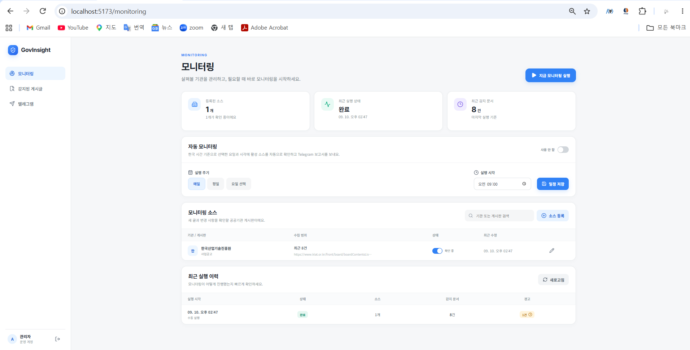
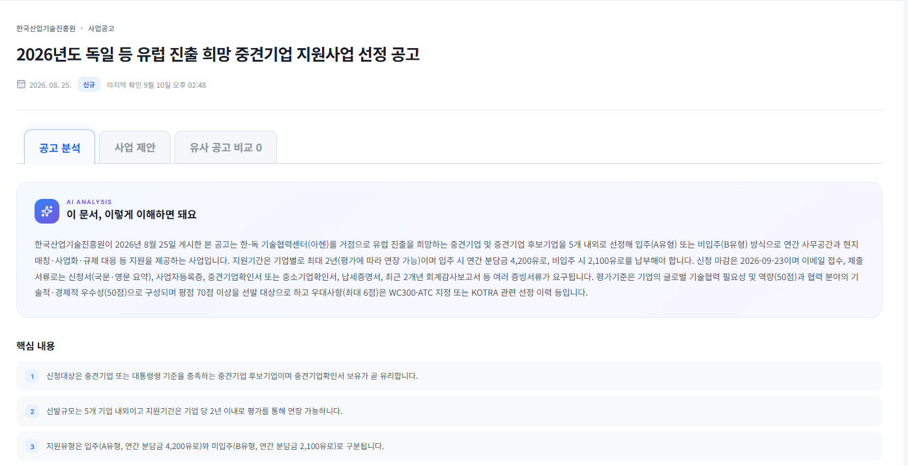
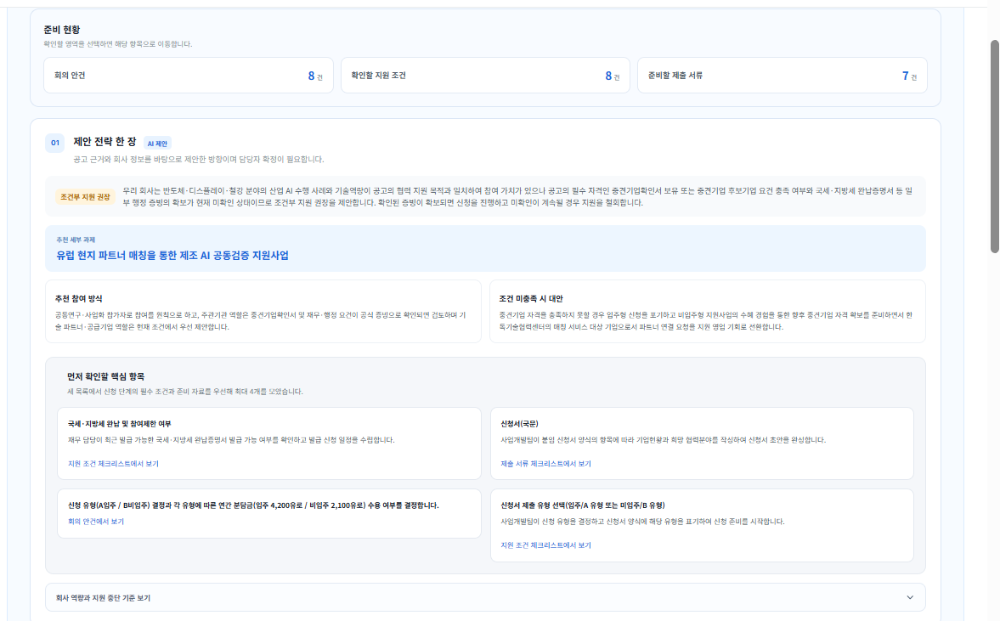
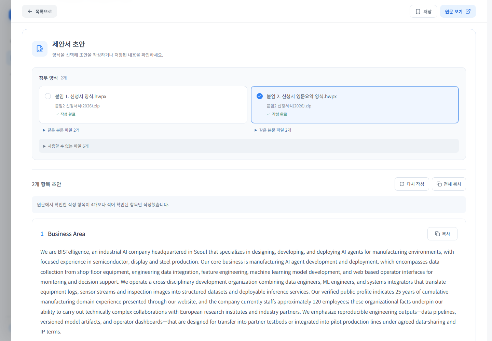
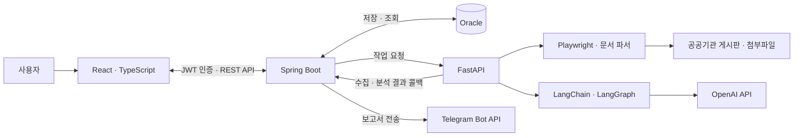

# GovInsight

**필요한 공고를 발견하고, 우리와의 관련성을 생각하는 일을 돕습니다.**

GovInsight는 공공기관의 공고와 첨부 문서를 수집·분석하고, 회사 정보를 바탕으로 사업 검토와 신청 준비를 지원하는 서비스입니다. 모니터링부터 공고 분석, 사업 제안, 양식별 초안 작성까지 하나의 흐름으로 연결합니다.

[설계 요약](docs/DESIGN.md) · [구현 현황](docs/PLAN.md) · [백엔드 실행 안내](backend/README.md) · [AI 모듈 실행 안내](ai/README.md)

## 1. 개발 배경

### 언제, 어디에 올라올지 모르는 공고

필요한 공고가 어느 기관의 게시판에 언제 올라올지는 미리 알기 어렵습니다. 관심 있는 기관을 정해 두더라도 웹사이트를 하나씩 방문하고, 새 글을 찾고, 첨부파일을 열어 내용을 확인해야 합니다. 이미 확인한 공고도 접수 일정이나 첨부 문서가 바뀌면 다시 검토해야 합니다.

공고를 찾은 뒤에도 판단할 내용은 남습니다. 우리 회사의 사업과 어떤 관련이 있는지, 신청 조건을 충족하는지, 어떤 역할로 참여할 수 있는지, 무엇을 준비해야 하는지를 생각해야 합니다. 공고의 정보와 회사의 상황을 연결하는 과정이 필요합니다.

GovInsight는 이 두 가지 부담에서 출발했습니다. **반복해서 찾아보는 일을 줄이고, 발견한 공고를 어떻게 활용할지 생각하는 데 필요한 정보를 모아 주는 것**이 개발 목적입니다.

### 기획 의도: 발견에서 신청 준비까지 연결

사용자가 궁금해하는 질문을 작업 흐름으로 정리했습니다.

| 사용자의 질문 | 서비스가 제공하는 정보 |
| --- | --- |
| 내가 살펴볼 공고가 새로 올라왔을까? | 등록한 게시판의 신규·수정 공고와 실행 이력 |
| 어떤 내용이고, 무엇이 바뀌었을까? | 본문·첨부파일 분석, 핵심 내용과 변경 검토 |
| 우리 회사와 어떤 관련이 있을까? | 회사 정보를 반영한 적합성 검토와 사업 제안 |
| 참여하려면 무엇부터 확인해야 할까? | 논의할 안건, 지원 조건, 제출 서류와 원문 근거 |
| 신청서 작성을 어디서부터 시작할까? | 실제 첨부 양식의 작성 항목에 맞춘 초안 |

분석 결과에서 공고 원문과 판단 근거를 다시 확인할 수 있게 하고, 확인이 필요한 조건과 제안 내용을 구분해 보여줍니다. 사용자는 이 정보를 바탕으로 참여 여부와 준비 방향을 결정합니다.

### 대상 사용자와 전달하려는 가치

주요 대상은 지원사업과 협력 기회를 검토하는 기업의 사업기획·연구개발·정부과제 담당자입니다. 여러 업무를 함께 맡으면서 기관별 공고를 꾸준히 확인해야 하는 상황을 고려했습니다.

서비스가 전달하려는 가치는 “관심 공고의 발견부터 우리 회사의 다음 행동까지 연결한다”는 것입니다. 게시판 순회와 첨부 문서 확인의 반복을 줄이고, 관련성 검토와 준비에 집중할 수 있도록 돕습니다. 모니터링 대상과 일정을 설정하고 새 결과를 확인하는 사용 흐름을 통해 지속적으로 활용할 수 있는 업무 도구를 지향합니다.

이는 서비스의 기획 목표입니다. 실제 사용자 도입 효과나 업무 시간 절감률은 아직 측정하지 않았습니다.

## 2. 사용 흐름

**모니터링 대상 설정 → 수집된 공고 검토 → 회사 맞춤 사업 제안 확인 → 양식별 초안 작성**

아래 화면은 개발 환경에 저장된 공고 분석과 초안의 예시입니다.

### ① 모니터링할 기관과 게시판을 설정합니다

확인할 공공기관 게시판과 수집 범위를 등록합니다. 필요할 때 직접 실행하거나 자동 실행 일정을 설정하고, 실행 이력에서 처리 상태와 경고를 확인합니다.



### ② 공고와 첨부파일의 핵심 내용을 확인합니다

감지된 게시글을 열어 공고 요약, 핵심 내용과 회사 관련 분석을 확인합니다. 원문 링크와 근거를 함께 살펴보며 검토할 사업을 좁혀 갑니다.



### ③ 회사 상황에 맞는 참여 방향과 준비사항을 검토합니다

사업 제안에서 추천 참여 방식과 확인할 조건을 살펴봅니다. 회의 안건·지원 조건·제출 서류를 구분해 준비하고, 비교할 공고가 있으면 유사 공고 비교 탭에서 목적과 신청 조건을 나란히 확인할 수 있습니다.



### ④ 첨부 양식을 선택해 초안을 작성하고 다듬습니다

작성 가능한 신청서·사업계획서 양식을 선택하면 해당 항목에 맞춘 초안을 생성합니다. 저장된 초안을 다시 열거나 수정 요청을 입력해 재작성할 수 있고, 이전 결과로 복원할 수도 있습니다. 작성 결과와 확인할 사항을 검토한 뒤 신청 자료에 활용합니다.



초안 작성은 사용자가 양식을 선택해 요청하는 별도 작업입니다. 모니터링 실행 완료가 모든 양식의 초안 생성 완료를 의미하지는 않습니다.

## 3. 핵심 기능과 적용 기술

| 기능 | 구현 내용 | 적용 기술 |
| --- | --- | --- |
| 게시판 모니터링 | 기관별 게시글과 첨부파일 수집, 수동·예약 실행, 실행 이력과 경고 조회 | Playwright, FastAPI, Spring Boot 스케줄링 |
| 문서 변경 감지 | 제목·본문·첨부파일 내용을 비교해 신규·수정·변경 없음 판정, 문서 버전 관리 | SHA-256, Spring Data JPA, Oracle |
| 첨부파일 읽기 | PDF·HWP·HWPX 및 ZIP 내부 문서의 텍스트 추출, 처리 제한과 실패 상태 관리 | pypdf, olefile, Python XML·ZIP 처리 |
| 회사 맞춤 공고 분석 | 본문·첨부·회사 정보·이전 버전 근거를 이용한 요약과 기회 검토 | LangChain, LangGraph, OpenAI API, Pydantic |
| 사업 제안과 초안 작성 | 참여 전략·준비사항 정리, 양식별 국문·영문 초안, 재작성·저장·복원 | 구조화 출력, 양식·언어·인용 검증, JPA 저장 |
| 유사 공고 비교 | 제목·사업 목적의 어휘 검색과 의미 검색을 결합해 비교 대상 선정, 신청 조건과 원문 조항 비교 | 임베딩, 코사인 유사도, RRF 순위 결합, Java 캐시 |
| 결과 알림 | 분석과 후속 사업 제안 처리 후 보고서 생성, Telegram 전송과 전송 이력 관리 | Spring Boot, Telegram Bot API |

## 4. 시스템 구조 및 기술 스택



| 영역 | 기술 | 담당 역할 |
| --- | --- | --- |
| Frontend | React, TypeScript, Vite | 모니터링 설정, 공고·분석 조회, 비교와 초안 작성 화면 |
| Backend | Java 21, Spring Boot 4.0.7, Spring Security, Spring Data JPA | 인증, 작업 조율, 변경 감지, 데이터 저장·조회, 예약 실행과 알림 |
| AI·수집 | Python 3.12, FastAPI, Playwright, LangChain, LangGraph | 게시글·첨부 수집, 문서 파싱, 근거 수집과 AI 분석 |
| 저장소 | Oracle | 사용자, 소스, 실행 이력, 문서 버전, 분석·보고서·초안 저장 |
| 외부 연동 | OpenAI API, Telegram Bot API | 문서 분석·생성·임베딩, 결과 알림 |
| 검증 | JUnit 5, Mockito, H2, pytest, Playwright, TypeScript, ESLint | 서비스·저장·API·분석 로직과 브라우저 흐름 확인 |

Python은 내부 HTTP API로 작업을 전달받고 결과를 반환합니다. Oracle에 직접 접근하는 책임은 Spring Boot에 모았습니다.

## 5. 주요 설계와 선택 이유

### 데이터 관리와 수집·AI 처리를 분리

인증, 문서 버전, 실행 상태와 초안 저장은 Spring Boot가 담당합니다. 브라우저 자동화와 문서 파싱, 모델 호출은 Python 모듈에서 처리합니다. 데이터 관계와 저장 규칙을 한곳에서 관리하면서, 수집·분석 라이브러리와 처리 흐름은 별도로 변경할 수 있는 구조입니다.

### 오래 걸리는 작업을 단계별로 처리

수집·분석 요청은 작업 ID와 접수 상태를 먼저 반환하고 백그라운드에서 실행합니다. 수집 결과 저장 이후 분석을 요청하고, 후속 사업 제안과 보고서 처리가 끝난 뒤 최종 완료 상태로 전환합니다.

이를 통해 접수·수집 완료·전체 완료를 구분하고, 어느 단계에서 실패했는지 실행 이력으로 확인할 수 있습니다. 모델 응답을 기다리는 동안 데이터베이스 저장 트랜잭션을 길게 유지하지 않도록 처리 경계도 분리했습니다.

### 변경된 문서를 중심으로 분석하고 결과를 재사용

게시글 제목과 본문뿐 아니라 첨부파일의 내용 해시도 버전 판정에 포함합니다. 파일명과 주소가 같아도 내용이 달라지면 수정으로 감지합니다.

변경 없는 문서에 유효한 분석이 있으면 재사용하고, 분석이 누락되었거나 결과 갱신이 필요한 경우에는 다시 처리합니다. 사용자가 재작성을 요청한 초안은 새 생성 요청으로 구분해 이전 완료 결과를 그대로 반환하지 않게 했습니다.

### AI의 의미 판단에 코드 검증을 결합

공고의 의미 해석과 회사에 맞는 제안은 모델이 담당합니다. 작성 항목의 원문 포함 여부, 인용 일치, 결과 구조, 작성 언어와 점수 산식 등은 코드로 검증·처리합니다.

분석 흐름에는 도구 사용과 재시도 제한을 두고, 실패 시 단계와 원인을 기록합니다. 확인하지 못한 정보를 사실로 보충하지 않도록 근거와 확인할 사항을 구분하는 것이 설계 기준입니다.

### 저장된 분석으로 유사 공고를 비교

유사 공고 조회는 저장된 임베딩과 제목·사업 목적의 어휘 정보를 사용합니다. 의미 점수와 어휘 순위를 결합하고 주제 충돌 등 최종 기준을 적용해 최대 3건을 반환합니다.

현재 규모에서는 Oracle에 저장된 벡터를 애플리케이션에서 비교하고, 정규화된 특징과 통계를 캐시합니다. 조회마다 모델을 다시 호출하지 않으며, 후보 수가 커졌을 때의 검색 비용은 계속 확인해야 합니다.

## 6. 검증 및 개선 사례

### 사례 1. 관련 없는 공고가 유사 공고로 연결되는 문제

**문제와 원인** — 실제 사업 목적이 다른 공고가 비교 대상으로 선정됐습니다. 목적을 찾지 못했을 때의 `원문에서 확인하지 못했습니다.` 같은 안내 문구가 공통 어휘로 계산되고 있었고, 일부 검색 경로의 선정 기준도 일관되지 않았습니다.

**해결** — 미확인 문장을 검색 입력에서 제외하고, 목적이 비어 있으면 원문 목적 구간과 저장 요약에서 보완했습니다. 모든 선정 경로에 주제 충돌 검사를 적용하고, 실제 공통 내용이 뒷받침되는지 확인하도록 기준을 정리했습니다. 반복 계산하던 문서 특징·통계는 캐시하고 상위 후보 선별도 보완했습니다.

**확인한 결과** — 실제 공고 11건의 55쌍으로 개발 회귀 평가를 진행했습니다. 같은 사업 2쌍을 양방향으로 찾았고, 목적이 다른 52쌍에서는 오탐이 없었습니다. 1쌍은 판단을 보류했습니다. 이 자료는 Codex가 원문·저장 분석을 검토해 초기 라벨을 붙인 소규모 개발 자료이며, 독립 검수나 미사용 평가셋에 대한 제품 정확도를 뜻하지 않습니다.

후보 5,000건의 합성 부하에서는 순위 계산 p95가 **6.034ms → 1.309ms**로 줄었습니다. 실제 공고 특징을 반복한 부하이며, DB·네트워크·벡터 생성과 캐시 구축 시간은 제외한 수치입니다. 전체 API 응답 시간의 개선율로 해석하지 않습니다.

[개선 과정과 측정 결과](docs/evaluations/notice-similarity-2026-09-10.md)

### 사례 2. 영문 신청서 초안이 반복해서 검증에 실패하는 문제

**문제와 원인** — 영문 양식의 본문을 생성한 뒤에도 문장 형식 검증에서 실패해 사용자에게 다시 시도하라는 안내가 반복됐습니다. 줄바꿈·강조 표기 같은 출력 형식과 실제로 미완성인 문장을 구분해서 처리할 필요가 있었습니다.

**해결** — 양식의 작성 언어를 먼저 판정하고, 영문 본문의 줄바꿈과 Markdown 표기 등을 정리한 뒤 문단 단위로 검증하도록 보완했습니다. 약어와 문장 끝의 따옴표·괄호를 고려하고, 미완성 절이나 작성 안내가 본문에 남는 경우는 별도로 거부합니다. 실패 위치와 문단 끝의 유형도 기록해 원인을 추적할 수 있게 했습니다.

**검증** — 영문·국문 교차 응답, 약어·괄호·줄바꿈, 미완성 문장과 근거 표식 잔존 등을 회귀 테스트로 확인했습니다. 형식 검증 통과와 실제 제출 품질은 구분하며, 생성된 내용은 사용자가 원문과 회사 상황에 맞게 검토합니다.

[영문 초안 오류를 해결한 과정](docs/case-studies/english-draft.md)

### 사례 3. 초안 재사용과 재작성을 구분하는 문제

**문제** — 저장된 초안을 빠르게 다시 보여주는 기능과, 사용자가 새 내용을 요청하는 재작성은 서로 다른 동작입니다. 완료 캐시를 그대로 사용하면 재작성 요청에도 이전 결과가 표시될 수 있고, 생성 실패나 중복 요청 때문에 기존 본문을 잃는 상황도 방지해야 했습니다.

**해결** — 재작성에는 별도 생성 요청 ID를 사용하고 완료 캐시를 우회합니다. 새 결과가 정상 생성·저장될 때 교체하며, 실패하면 기존 초안과 수정 요청을 보존합니다. 동시 요청과 저장 버전을 확인하고 직전 초안 복원도 지원합니다.

**검증** — 재작성 요청 전달·캐시 우회·실패 시 보존·동시 요청·버전 충돌·복원을 테스트했습니다. 브라우저에서는 생성 중 화면 이탈과 재진입, 새로고침, 응답 유실 상황을 모의 API로 확인했습니다.

[재작성과 실패 복구 설계](docs/case-studies/draft-regeneration.md)

### 검증 범위

2026-09-10 개발 기록 기준으로 백엔드 **288개**, AI 모듈 **443개** 테스트가 통과했습니다. 프론트엔드 빌드는 통과했고, ESLint에는 기존 React Hook 경고 2개가 남아 있습니다.

서비스 로직, H2 기반 저장·API 테스트, 모델·외부 호출을 대체한 분석 테스트와 브라우저 검증을 함께 사용합니다. 모의 응답 검증과 실제 모델·공고로 확인한 결과는 [구현·검증 현황](docs/PLAN.md)에서 구분합니다.

검증 명령은 각 모듈 디렉터리에서 실행합니다.

```powershell
# backend/
.\gradlew.bat test

# ai/ — 가상환경과 개발 의존성 설치 후
python -m pytest

# frontend/
npm run build
npm run lint
```
